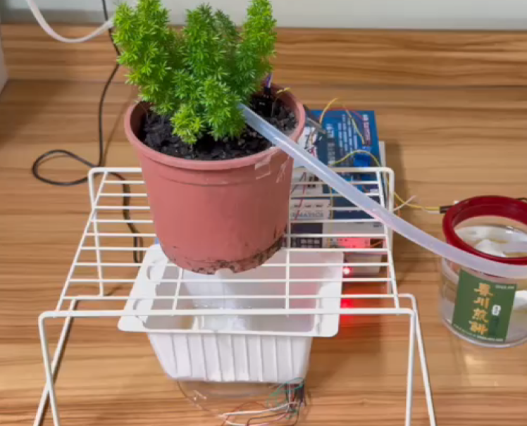

# Aiot Project
這是一個物聯網期末project。為了避免栽培興趣的人忙於生活、忘記給植物澆水我們使用:
- 土壤濕度感測器、溫濕度感測器、重量感測器實時監測植物和環境狀況
- 透過爬蟲獲取最新天氣資訊
- 使用LSTM預測未來幾天的澆水量
- 架設網站以及[手機app](https://github.com/Edmond-Yang/Plant-Watering-App)讓使用者可以及時查看植物情況以及環境數據
- 植物及環境資訊每半小時進行監測

## 硬體連接圖

## 檔案

### ./

| File Name                                  | Description                                                   |
| ------------------------------------------ | --------------------------------------------------------------|
| main.py                                    | 執行 fastapi 後端程式                                         |
| DockerFile                                 | Container 環境所需執行的指令                                   |
| README.md                                  | 紀錄要務                                                       |

### service/

| File Name                                  | Description                                                   |
| ------------------------------------------ | --------------------------------------------------------------|
| sql.py                                     | 連接 Cloud SQL                                                |
| webCrawl.py                                | 爬蟲 天氣資訊                                                  |
| example.txt                                | SQL 指令函式 例子                                              |

### settings/

| File Name                                  | Description                                                   |
| ------------------------------------------ | --------------------------------------------------------------|
| requirements.txt                           | python 環境所需套件 (任何需要透過 pip 下載的套件)                |
| root_ca.txt                                | esp32 連接 api 時所需憑證                                      |
| southern-tempo-387713-75d923658592.json    | Cloud SQL Proxy 所需密鑰 **(為安全守則，該檔案已下架)**        |

### hardware/

| File Name                                  | Description                                                   |
| ------------------------------------------ | --------------------------------------------------------------|
| ESP32_code.ino                             | ESP32的code                                                   |
| wiring & note.txt                          | 接線與程式的說明                                               |

### templates/

| File Name                                  | Description                                                   |
| ------------------------------------------ | --------------------------------------------------------------|
| index.html                                 | 觀看 Plants 資料庫的簡易網頁                                   |

### static/

| File Name                                  | Description                                                   |
| ------------------------------------------ | --------------------------------------------------------------|
| icon.PNG                                   | 櫻花 Image 用於網頁的 Icon                                     |

### LSTM/
| File Name                                  | Description                                                   |
| ------------------------------------------ | --------------------------------------------------------------|
| main.py                                    | 預測天氣使用 function: Predict_watering_amount()               |
| requirements.txt                           | 使用packages                                                  |

## 網頁API (已下架)
| Route                                                                                    | Description                           |
| ---------------------------------------------------------------------------------------- | ------------------------------------- |
| [/](https://aiot-server-shsjao25ha-de.a.run.app/)                                        | 運行成功檢視 "test ok"                |
| [/lstm](https://aiot-server-shsjao25ha-de.a.run.app/lstm)                                | 得到 lstm 結果                        |
| [/getFormattedData](https://aiot-server-shsjao25ha-de.a.run.app/getFormattedData)        | 得到 plants 資料庫所有資料            |
| [/getAppData](https://aiot-server-shsjao25ha-de.a.run.app/getFormattedData)              | 得到 plants 資料庫最近十筆資料        |
| [/DataCheck/weather](https://aiot-server-shsjao25ha-de.a.run.app/DataCheck/weather)      | plants 資料庫所有資料視覺化           |
| [/DataCheck/plants](https://aiot-server-shsjao25ha-de.a.run.app/DataCheck/plants)        | weather 爬蟲 資料視覺化               |
| [/DataCheck/watering](https://aiot-server-shsjao25ha-de.a.run.app/DataCheck/watering)    | records 資料庫所有資料視覺化          |
| [/execute/...](https://aiot-server-shsjao25ha-de.a.run.app/execute/...)                  | 可以執行 SQL query                   |

## 貢獻
* [楊世宇](https://github.com/Edmond-Yang)
* [楊峻豪](https://github.com/daaaaaaavid)
* [林庭毅](https://github.com/TingYeeet)
* [陳建維](https://github.com/TamakiSilSha)
